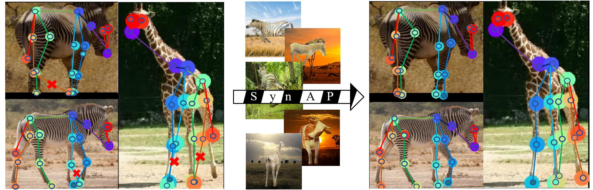

# Prior-Aware Synthetic Data to the Rescue: Animal Pose Estimation with Very Limited Real Data
*Authors: Le Jiang, Shuangjun Liu, Xiangyu Bai, Sarah Ostadabbas*

<p align="center">
  <a href="#Introduction">Introduction</a> |
  <a href="#Framework">Framework</a> |
  <a href="#Main Results">Main Results</a> |
  <a href="#Synthetic Animal Data Generation">Synthetic Animal Data Generation</a> |
  <a href="#Experiment">Experiment</a> |
  <a href="#Acknowledgments">Acknowledgments</a> 
</p>

## Introduction
<p align="center">

</p>
This repository is the official repository of <a href='https://arxiv.org/abs/2208.13944'>[Prior-Aware Synthetic Data to the Rescue: Animal Pose Estimation with Very
Limited Real Data</a>. We purposed a prior-aware synthetic animal data generation pipeline called PASyn to augment the animal 
pose data essential for robust pose estimation. PASyn generates a probabilistically-valid synthetic pose dataset, SynAP,
through training  a variational generative model on several animated 3D animal models. In addition, a style transfer strategy
is utilized to blend the synthetic animal image into the real backgrounds.  We evaluate the improvement made by our approach
with three popular backbone networks and test their pose estimation accuracy on  publicly available animal pose images as
well as collected from real animals in a zoo. 

## Framework
<p align="center">

</p>
Our proposed prior-aware synthetic data generation (PASyn) pipeline enables robust animal
pose estimation under severe label scarcity and divergence. The architecture of PASyn is
shown in Fig. 2, where we employ a graphic engine (i.e., Blender) to render the 3D animal
mesh model into synthetic images. PASyn pipeline is composed of 3 key components: (1)
pose data augmentation, (2) synthetic data stylization, and (3) synthetic animal pose im-
age dataset generation. For more details, please refer to our paper.

## Main Results
### The effect of SynAP with limited real data of pose estimation results of three common backbones, HRNet-w32,EfficientNet-B6, and ResNet-50 tested on Zebra-300 (300 real images).  
| Method | Backbone| Train Set  | Average |Eye | Nose | Neck | Shoulders | Elbows | F-Paws | Hips |Knees | B-Paws | RoT | 
|---|---|---|---|---|---|---|---|---|---|---|---|---|---|
| MMPose | HRNet-w32 | R(99) |78.7| 97.3 | 95.8 | **83.2** | 78.8 | 77.1 | 62.6 | 86.0 | 74.9| 59.8|82.4|
| MMPose | HRNet-w32 | R(99)+S(3K) |**92.4**| **97.8** |**98.3** |81.1  |**94.0**  |**93.5**  | **92.0** | 93.7| 93.5 | 89.0 |**87.6**|
| MMPose | HRNet-w32 | R(99)+S(5K) | 91.6 | 97.5 | 96.9 |81.8  |89.6  |91.3 | 90.7| **94.1** |**94.1**  |**90.4** |86.0|
| DeepLabCut| EfficientNet-B6 | R(99) | 83.6 | 93.7 | 96.2 |**82.5**  |**91.4**  | 80.8 |67.4 |88.1  |84.5  |71.8 |83.2|
| DeepLabCut | EfficientNet-B6 |R(99)+S(3K) |87.6|**95.1**  |**97.9**  | 81.5 | 90.1 | 83.3 |75.5 |**93.2**  |89.3  |83.9 |**86.8**|
| DeepLabCut | EfficientNet-B6 | R(99)+S(5K) |**89.2**  |94.1  |92.6|80.8  |90.8  |**87.0**  |**85.7**  |90.5 |**93.3**  |**88.3**  |**86.8** |
| MMpose | ResNet-50 | R(99) | 76.9| 96.2 |96.9  | **80.8** |59.0  |71.3  |71.2 | 88.5 | 78.2 |59.3 |85.2|
| MMpose | ResNet-50 | R(99)+S(3K) | 86.7 |95.6  |95.8  |69.9  |**87.3**  |**84.3**  |84.3|90.8 |91.2  |84.4  |77.2 |
| MMpose | ResNet-50| R(99)+S(5K) | **84.4** |**97.0**  | **97.9** |74.5  | 85.3 | 84.2 |**84.5** | **94.6** | **91.4** |**88.0** |**85.6**|

### The effect of SynAP with large set of real data in pose estimation results of HRNet-w32 \cite{hrnet} tested on Zebra-300 (300 real images). 
| Train Set| Real Zebra  | Average |Eye | Nose | Neck | Shoulders | Elbows | F-Paws | Hips |Knees | B-Paws | RoT | 
|---|---|---|---|---|---|---|---|---|---|---|---|---|
| R(8K)(SOTA) | &check;  |91.4| **97.5** | 97.2 |79.4 | 87.8| 90.3 |93.8| 95.3 | 94.1 | 89.5| 86.6|
| R(8K)+S(3K) | &check; | 93.8| 97.3 |**98.3** |79.0  |93.1  |94.9  | 96.0 | 95.3| 96.7 | 93.3 |**89.6**|
| R(8K)+S(5K) | &check;|  **94.2** | 97.3 | 97.6 |**81.1**  |**93.7**  |**95.7** | **96.0**| **96.6** |96.0  |**94.3** |87.6|
| R(8K)| &cross; |  78.3 | 79.7 | 87.7 |37.4  |77.6  | 80.0 |87.6 |82.0  |86.4  |81.3 |67.2|
| R(8K)+S(3K) | &cross; |88.2|94.8  |96.2 | **67.1** | 90.8 | 87.9 |90.2|87.6  |91.6  |89.7|77.6|
| R(8K)+S(5K) | &cross; | **90.2**  |**97.5**  |**96.2**|66.1  |**91.6**  |**89.5**  |**93.8**  |**93.9** |**93.5**  |**91.1**  |**77.6** |

## Synthetic Animal Data Generation
If you want to generate your own synthetic dataset, please follow the [README.md] in the folder (Under construction).

## Experiment
To reproduce the results in the tables above, you have to follow the <a href='https://github.com/AlexTheBad/AP-10K/edit/main/README.md'>Readme.md</a> for setup.
There is the file structure of the AP-10K below. 

```
AP-10K
├── mmpose
├── docs
├── tests
├── tools
├── configs
|── README.md
|── requirements.txt
|── data
    │── ap10k
        │-- annotations
        │   │-- ap10k-train-split1.json
        │   │-- ap10k-val-split1.json
        │   |-- ap10k-test-split1.json
        │   |-- ...      
        │-- data
        │   │-- 000000000001.jpg
        │   │-- 000000000002.jpg
        │   │-- ...
```
### Installation
Please refer to <a href='https://github.com/open-mmlab/mmpose/blob/master/docs/en/install.md'>install.md</a> for Installation.
### AP-10K Dataset
The dataset and corresponding files can be downloaded from <a href='https://drive.google.com/file/d/1-FNNGcdtAQRehYYkGY1y4wzFNg4iWNad/view?usp=sharing'>[Google Drive]</a>. Please unzip
the dataset and place the dataset `ap10k` in the folder `data` under the root directory.
### SynAP Dataset
For SynAp data, please download `SynAP.zip` from [SynAP](https://coe.northeastern.edu/Research/AClab/SynAP/), which contains 3,000 synthetic zebra images and 3,600 synthetic images of 6 other animals, and 
different way to split the dataset. We provided the annotations for the splits of `only 99 real zebra images`, `real images + 3000 SynAP zebra images`,
`real images + 3000 syn zebra + 1800 other syn animal`, as well as `real images + full SynAP+ dataset`.  After you download the SynAP dataset, please put the images of SynAP in the folder where you keep AP-10K images.
```
SynAP
├── annotations_99
├── annotations_99+3000 (SynAP)
├── annotations_99+3000+1800 (SynAP+)
├── annotations_99+3000+3600 (SynAP+)
├── cow_0000.jpg
|── cow_0001.jpg
|── cow_0002.jpg
|── ...
```
In order to know each split more intuitively, you can use the script provided by us:
```
python scripts/split.py 
```
### Training on SynAP dataset
To train on SynAP dataset, please replace the annotations file `ap10k-train-split1.json` and `ap10k-val-split1.json`  with the 
annotations we provided in SynAP before you start the training. 
```
bash tools/dist_train.sh configs/animal/2d_kpt_sview_rgb_img/topdown_heatmap/ap10k/hrnet_w32_ap10k_256x256.py 1
```

### Test on Zebra-300 and Zebra-Zoo Dataset
1. Train your own model or download our pretrained models [HRNet-w32](https://drive.google.com/file/d/1hofB5mlKcEEeGBMZbuzvcI5GlsHkJ0S2/view?usp=sharing), which is trained with 99 real zebra images from AP-10K dataset and 3,000 synthetic zebra from SynAP dataset (the best model).
2. Please download `zebra-300.zip` and `zebra-zoo.zip` from [SynAP](https://coe.northeastern.edu/Research/AClab/SynAP/).
3. Place the images in `zebra-300/crop` and `zebra-zoo/crop` in `data/ap10k/data` as well, and replace the `ap10k-test-split1.json`
with the annotations we provided.
```
zebra-300
├── annotations
    │── annotations.json
    │── annotations.csv
├── crop
    │── 000000030372.jpg
    │── ...
├── raw
```
4. Run the code provided by AP-10K:
```
python tools/test.py configs/animal/2d_kpt_sview_rgb_img/topdown_heatmap/ap10k/hrnet_w32_ap10k_256x256.py <DET_CHECKPOINT_FILE>
```
## Citation

If you use our code, datasets or models in your research, please cite with:

```
@misc{https://doi.org/10.48550/arxiv.2208.13944,
  doi = {10.48550/ARXIV.2208.13944},
  
  url = {https://arxiv.org/abs/2208.13944},
  
  author = {Jiang, Le and Liu, Shuangjun and Bai, Xiangyu and Ostadabbas, Sarah},
  
  keywords = {Computer Vision and Pattern Recognition (cs.CV), FOS: Computer and information sciences, FOS: Computer and information sciences},
  
  title = {Prior-Aware Synthetic Data to the Rescue: Animal Pose Estimation with Very Limited Real Data},
  
  publisher = {arXiv},
  
  year = {2022},
  
  copyright = {arXiv.org perpetual, non-exclusive license}
}
```
## Acknowledgement
Thanks for the open-source
* AP-10K: [A Benchmark for Animal Pose Estimation in the Wild, Hang Yu, Yufei Xu, Jing Zhang, Wei Zhao, Ziyu Guan, Dacheng Tao](https://github.com/AlexTheBad/AP-10K/)
* StyTr^2: [Image Style Transfer with Transformers, Yingying Deng and Fan Tang and Weiming Dong and Chongyang Ma and Xingjia Pan and Lei Wang and Changsheng Xu](https://github.com/diyiiyiii/StyTR-2)
* SmplifyX: [Expressive Body Capture: 3D Hands, Face, and Body from a Single Image, Pavlakos, Georgios and Choutas, Vasileios and Ghorbani, Nima and Bolkart, Timo and Osman, Ahmed A. A. and Tzionas, Dimitrios and Black, Michael J.](https://github.com/vchoutas/smplify-x).
## License 
* This code is for non-commertial purpose only. 
* For further inquiry please contact: Augmented Cognition Lab at Northeastern University: http://www.northeastern.edu/ostadabbas/ 
